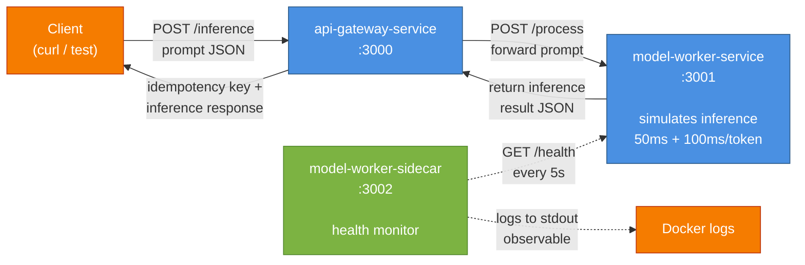
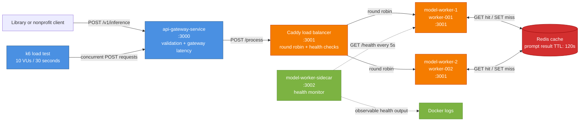

# Initial Service List

The two-person team targets three custom services: one owned service per member
and one shared entry point.

- `inference-router-service` (owner: georgesalomon): Tracks mock worker health and load, selects an available worker for each request, and fails over when the selected worker is unavailable.
- `model-worker-service` (owner: fahuddin): It just simulates language-model inference with configurable processing latency, capacity limits, health state, scripted failures, queues, and prefix hits.
- `api-gateway-service` (Sprint 2 owner: georgesalomon; shared long-term): Validates incoming inference requests, assigns or accepts an idempotency key, and returns a consistent response while acting as the first shared entry point.

Replicated instances of `model-worker-service` are nodes of the same custom
service rather than additional services. Caddy, Redis, Prometheus, and Grafana
may be added later as infrastructure and are not included in this count.

---

## Sprint 2: System Architecture (First Containerized System)

### Services Deployed

Sprint 2 delivers the first two custom services under Docker Compose, alongside a health-monitoring sidecar:

1. **api-gateway-service** (georgesalomon owner for Sprint 2; shared long-term): Entry point for inference requests. Validates incoming prompts, assigns or accepts idempotency keys, simulates gateway processing latency, and forwards to the model worker.
2. **model-worker-service** (fahuddin owner): Simulates LLM inference with realistic latency (50ms base + 100ms per simulated token). Tracks load and capacity. Returns domain-relevant JSON with workerId, processingTimeMs, result, currentLoad, and capacity.
3. **model-worker-sidecar** (shared): Health-monitoring sidecar. Polls the worker's `/health` endpoint every 5 seconds and logs results to stdout for observability. Demonstrates the sidecar pattern.

The `inference-router-service` (georgesalomon owner) is deferred to Sprint 3+ for a later implementation that will integrate with multiple workers and implement failover logic.

### Sprint 2 System Diagram



### Endpoints

**api-gateway-service** (port 3000):
- `GET /status` → domain-specific gateway health, community, role, and routing target
- `POST /inference` or `POST /v1/inference` (accepts `{prompt}`) → injects 80–200 ms of gateway latency, forwards to the worker, and returns the routing decision and inference response with an idempotency key

**model-worker-service** (port 3001):
- `GET /health` → `{workerId, status, currentLoad, capacity, processingCount, timestamp}`
- `POST /process` (accepts `{prompt}`) → simulates inference with latency, returns `{workerId, prompt, processingTimeMs, result, tokenCount, timestamp, capacity, currentLoad}`

**model-worker-sidecar** (port 3002):
- `GET /status` → last observed worker health state + sidecar timestamp
- Health polling runs automatically every 5s, logs to stdout

### Docker Compose & Startup

The system runs under Docker Compose with a single command:
```bash
docker compose up
```

All three containers are defined in `docker-compose.yml` at the repository root. The model-worker includes a health check (`GET /health`); the api-gateway and sidecar depend on the worker reaching healthy state before they start (`depends_on` with `condition: service_healthy`).

Expected startup sequence:
1. model-worker starts and becomes healthy (~5 seconds)
2. api-gateway and sidecar start once model-worker is healthy
3. Sidecar begins polling model-worker health and logging every 5 seconds
4. System ready for inference requests

### Observed Behavior

Test the system with:
```bash
# Gateway health
curl http://localhost:3000/status

# Submit inference request (observe latency based on prompt length)
curl -X POST http://localhost:3000/inference \
  -H "Content-Type: application/json" \
  -d '{"prompt": "What food and housing resources are available in my area?"}'

# Worker health
curl http://localhost:3001/health

# Sidecar status (last observed health)
curl http://localhost:3002/status

# View sidecar logs (observable health polling every 5 seconds)
docker compose logs model-worker-sidecar
```

### Grading Alignment (Sprint 2)

✅ **docker-compose.yml** exists at root; `docker compose up` starts all containers (15 pts)
✅ **Sidecar** is separate container with observable health logging to stdout (20 pts)
✅ **All services** have own Dockerfile (5 pts)
✅ **Domain-relevant endpoints** return JSON with plausible fields (workerId, processingTimeMs, currentLoad, capacity, etc.) (10 pts)
✅ **System diagram** in this document shows services, connections, and sidecar position (10 pts)
✅ **fahuddin (model-worker)**: Dockerfile builds and starts; returns domain JSON; injects realistic setTimeout latency (40 pts individual)
✅ **georgesalomon (api-gateway)**: Dockerfile builds and starts; returns domain JSON for public-resource inference routing; injects realistic setTimeout latency (40 pts individual)

---

## Sprint 3: Replication, Load Balancing, and Caching

Sprint 3 replicates `model-worker-service` as `model-worker-1` and
`model-worker-2`. Caddy uses round-robin load balancing and active `/health`
checks to send requests only to healthy replicas. Both replicas share Redis,
which caches normalized prompts for 120 seconds. A response includes
`workerId`, `servedBy`, and `cacheStatus`, so replica selection and cache
hit/miss behavior are observable.

### Current System Diagram



### Sprint 3 Endpoints and Verification

- `POST http://localhost:3000/v1/inference` exercises the complete gateway,
  Caddy, replicated-worker, and Redis path.
- `GET http://localhost:3001/health` goes through Caddy and identifies the
  selected worker replica.
- `GET http://localhost:3001/cache-stats` shows per-replica cache counters.
- Repeated prompts return `cacheStatus: "hit"` with low worker processing
  latency; first-time prompts return `cacheStatus: "miss"` after simulated
  inference latency and are stored in Redis.
- `docker compose stop model-worker-1` demonstrates that Caddy continues
  serving requests through `model-worker-2`.
- `docker compose --profile load-test run --rm k6` runs the Sprint 3 baseline
  load test.
